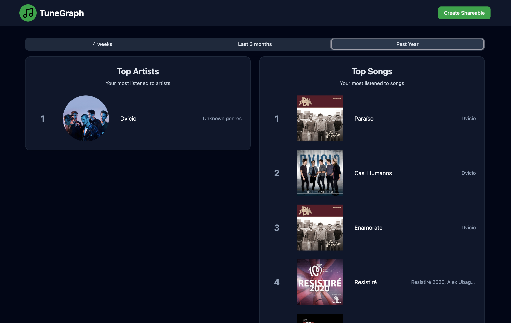
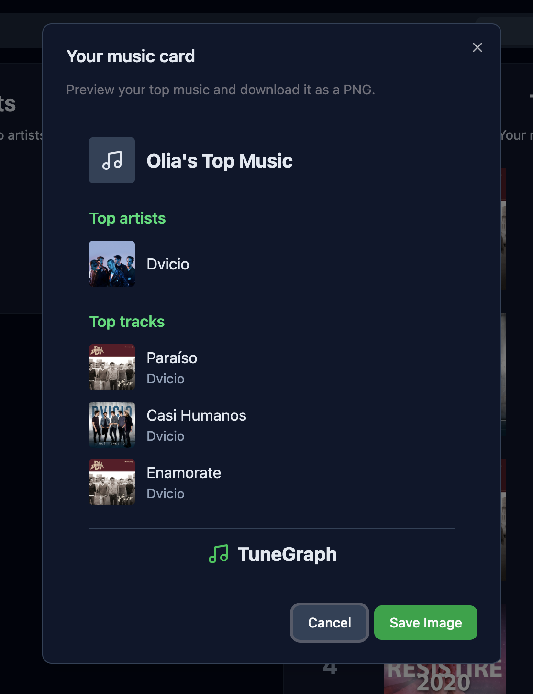

# TuneGraph

## Project overview
TuneGraph is a team-built Spotify dashboard that turns your top artists and tracks into a visual summary and a downloadable music card.
This repository contains a React client and an Express API; it is a local portfolio project, with no production deployment documented.

### My contributions
Git history attributes these contributions to Olga Bel:
- Hardened OAuth state validation and token lifecycle handling (`35e50bf`).
- Restored production builds and separated frontend/backend test configuration (`32a7bf7`).
- Expanded backend behavioral and route integration tests, with coverage thresholds (`98a66ea`).

## Demo

The dashboard displays Spotify top artists and tracks.



The share card can be downloaded as a PNG image.



## Key features
- Sign in through Spotify's Authorization Code OAuth flow.
- View top artists and tracks across three Spotify time ranges.
- Compare Spotify artist popularity in a bar chart; these values are not personal play counts.
- Generate a card with your profile name/avatar, three top artists, and three top tracks, then download it as a PNG image.

## How it works
The browser starts login through Express, which redirects to Spotify and exchanges the callback code on the server.
Cryptographically random OAuth state must match the query, httpOnly cookie, and an unexpired server entry; validation consumes it to prevent reuse.
Tokens remain in httpOnly, SameSite=Lax cookies, with Secure enabled when `NODE_ENV=production`; local HTTP development does not set Secure.
Access-cookie lifetime follows Spotify's `expires_in`; refresh cookies have a 30-day retention period.
`POST /api/auth/refresh` refreshes access and replaces the refresh cookie only when Spotify returns a new refresh token.
Spotify credentials remain on the server, and authenticated API requests attach the access token to upstream requests.

[Spotify defines the ranges](https://developer.spotify.com/documentation/web-api/reference/get-users-top-artists-and-tracks) as:
- `short_term`: approximately the last four weeks.
- `medium_term`: approximately the last six months.
- `long_term`: approximately one year of data, incorporating new data as it becomes available.

## Tech stack
React 19, TypeScript, Vite, Tailwind CSS, Radix UI, Recharts, and html2canvas-pro on the client.
Express 5, cookie-parser, dotenv, and Node fetch on the server.
Vitest, Testing Library, jsdom, Supertest, and V8 coverage support testing.

## Architecture
```text
React client → Express API → Spotify Web API
client/src/    server/app.ts
```
- `client/src/components` and `hooks`: dashboard, chart, PNG generation, and API fetching.
- `server/routes`, `controllers`, `middlewares`, and `utils`: OAuth, protected endpoints, query validation, and sanitized upstream errors.
- `server/app.ts`: configured, testable Express app; `server/index.ts`: environment loading and process startup.
- Vite proxies `/api` to Express in development. There is no database.
- The API also implements rank-weighted top genres and profile lookup; the dashboard has no dedicated top-genres view.

## Testing
Run from the repository root:
```bash
npm test                               # all tests, non-watch
npm run test:frontend                  # frontend: jsdom
npm run test:backend                   # backend: Node
npm --prefix server run test:coverage  # backend V8 coverage
npm run build                         # client production build
npm run typecheck:server               # independent Express type-check
```
Verified locally on September 17, 2026: **202 passing tests** (9 frontend, 193 backend).
Backend coverage: **100% lines, 100% statements, 98.65% branches, 100% functions**.
Enforced thresholds: **85% lines, 85% statements, 90% branches, 95% functions**.
Coverage includes `server/app.ts` and all production TypeScript in controllers, middleware, routes, and utilities.
Only tests, declarations/types, generated output, and the minimal process-startup entry point are excluded.
Spotify requests are mocked; this coverage does not establish live Spotify or browser OAuth behavior.

## Local setup
Use Node **22.12+ within the 22.x release line** and npm; verified with Node **22.20.0 / npm 10.9.3**.
The repository declares no npm engine requirement; installed Vite/jsdom require at least Node 22.12 on this release line.
From the repository root:
```bash
npm ci
cp .env.example .env
```
Copy only if `.env` does not already exist. Fill in your own credentials after configuring the Spotify application below.
The root `.env` is loaded by dotenv when the backend starts through the root scripts; do not place it under `client/` or commit it.
Start both development processes with `npm run dev:all`, or use separate terminals:
```bash
npm run dev
npm run dev:server
```
Client: `http://127.0.0.1:5173`; API: `http://127.0.0.1:3001`.
Keep port 5173 available: the frontend origin and callback destination must match the actual client URL.
`GET http://127.0.0.1:3001/` returns the API welcome message.
`GET http://127.0.0.1:3001/api/auth/status` reports access-cookie presence, not upstream token validity.

## Spotify application setup
1. Open the [Spotify Developer Dashboard](https://developer.spotify.com/dashboard) and create an application for the Web API.
2. In application settings, register this exact redirect URI: `http://127.0.0.1:3001/api/auth/callback`.
3. Save the settings and copy your own Client ID and Client Secret into the root `.env`.
4. Ensure your test account is allowed by the application's current Spotify access/development-mode settings.
The application requests only `user-top-read`. Follow Spotify's [application guide](https://developer.spotify.com/documentation/web-api/concepts/apps) and [redirect URI rules](https://developer.spotify.com/documentation/web-api/concepts/redirect_uri); use the loopback IP consistently.

## Environment variables
See the tracked [`.env.example`](.env.example); all values there are safe placeholders or local defaults.
- `SPOTIFY_CLIENT_ID`, `SPOTIFY_CLIENT_SECRET`: required for a complete login/token exchange; never expose the secret in frontend variables.
- `SPOTIFY_REDIRECT_URI`: optional; defaults to `http://127.0.0.1:3001/api/auth/callback`.
- `FRONTEND_URL`: set to `http://127.0.0.1:5173` for consistent CORS and post-login redirects; internal fallback values differ.
- `PORT`: optional API port, default `3001`; the Vite proxy is fixed to 3001, so keep this default for local setup.
- `NODE_ENV`: optional; use `development` locally. `production` enables Secure cookies and requires HTTPS.

## Current limitations
- The UI incorrectly labels `medium_term` as “Last 3 months”; Spotify actually returns approximately six months.
- The PNG card always uses `medium_term`, independently of the dashboard's selected range; downloading an image does not post it to social media.
- The frontend does not automatically call the refresh endpoint, and there is no logout flow.
- OAuth state is held in process memory: restarting the server invalidates pending logins, and multiple instances do not share state.
- No recently played history, playlists, playback, or personal play counts are implemented.
- Current checks emit React `act` warnings and a Vite large-bundle warning; tests and the build still pass.
